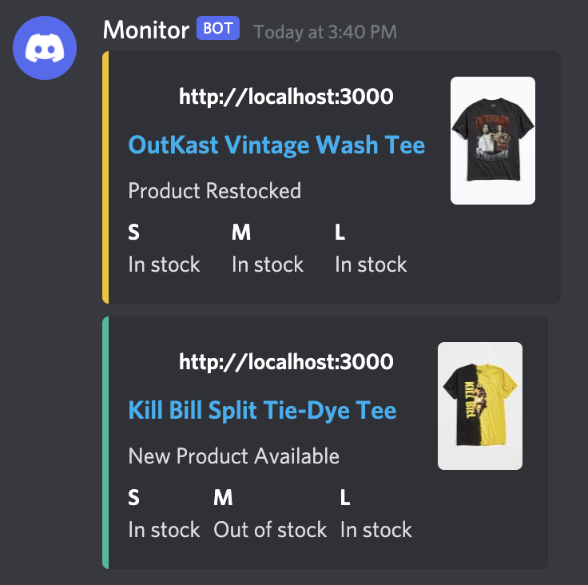

**shop-watch** monitors Shopify stores for new inventory.

</img>

## Usage
First, configure `settings.toml`:
* `webhook`: the Discord webhook URL to post alerts to.
* `sites`: a list of Shopify site URLs to monitor.

If you'd like to use proxies, add them to `proxies.txt` in the format `HOST:PORT` separated by a new line. Like this:

```
11.11.111.111:1111
22.22.222.222:2222
33.33.333.333:3333
```

Finally, run `npm start`.